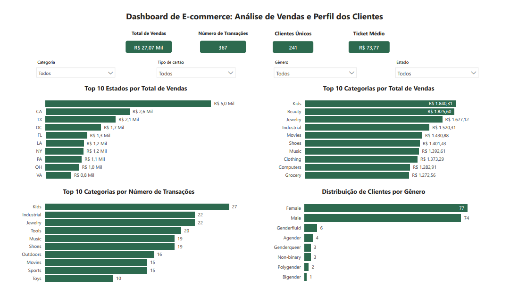

# Dashboard de E-commerce: Análise de Vendas e Perfil dos Clientes

Este projeto foi desenvolvido com o objetivo de consolidar dados de transações e clientes de um e-commerce utilizando SQL e criar um dashboard analítico no Power BI.

## Objetivo

Realizar a junção de duas tabelas por meio de SQL, exportar a base consolidada para CSV e desenvolver um dashboard com métricas relevantes para análise de vendas e perfil dos clientes.

## Ferramentas utilizadas

- Python
- Pandas
- SQLite
- SQL
- Jupyter Notebook
- Power BI

## Etapas do projeto

1. Carregamento das bases de transações e clientes.
2. Criação das tabelas no SQLite.
3. Realização do LEFT JOIN entre as tabelas.
4. Justificativa da escolha do JOIN.
5. Exportação da base consolidada para CSV.
6. Desenvolvimento do dashboard no Power BI.
7. Análise das principais métricas de vendas e perfil dos clientes.

## Dashboard

## Métricas analisadas

- Total de vendas
- Número de transações
- Clientes únicos
- Ticket médio
- Top 10 estados por total de vendas
- Top 10 categorias por total de vendas
- Top 10 categorias por número de transações
- Distribuição de clientes por gênero

## Conclusão

O projeto permitiu consolidar informações de vendas e clientes em uma base única, facilitando a análise do desempenho do e-commerce. O dashboard final apresenta uma visão clara das principais métricas comerciais e do perfil dos clientes, apoiando a tomada de decisão baseada em dados.